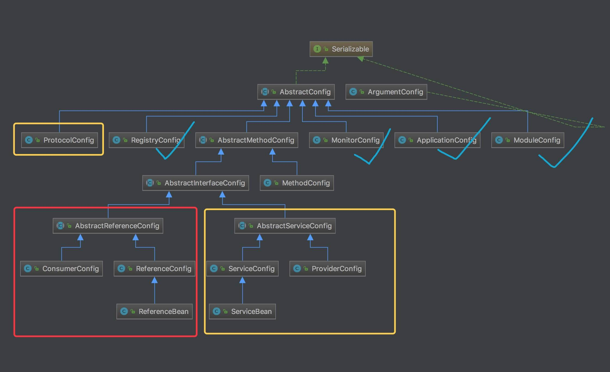

1. Dubbo 目前提供了四种配置方式，分别是：

Api 配置方式

属性配置方式

XML 配置方式

注解配置方式

2. 所有的配置项目又可以分为三大类：

(1)服务发现

用于服务的注册与发现，也就是说让消费者能够找到提供方

(2)服务治理

用于治理服务间的关系

(3)性能调优

用于性能调优，不同的选项对性能会产生影响

总结： 所有的配置项最终都会转换为Dubbo URL表示，并由服务提供方生成，再经注册中心传递给消费方。





3. 源码解析

配置说明文档：https://cn.dubbo.apache.org/zh-cn/overview/mannual/java-sdk/reference-manual/config/api/

提供者初始代码：

```java
import org.apache.dubbo.config.ApplicationConfig;
import org.apache.dubbo.config.RegistryConfig;
import org.apache.dubbo.config.ProviderConfig;
import org.apache.dubbo.config.ServiceConfig;
import com.xxx.DemoService;
import com.xxx.DemoServiceImpl;

public class DemoProvider {
    public static void main(String[] args) {
        // 服务实现
        DemoService demoService = new DemoServiceImpl();

        // 当前应用配置
        ApplicationConfig application = new ApplicationConfig();
        application.setName("demo-provider");

        // 连接注册中心配置
        RegistryConfig registry = new RegistryConfig();
        registry.setAddress("zookeeper://10.20.130.230:2181");

        // 服务提供者协议配置
        ProtocolConfig protocol = new ProtocolConfig();
        protocol.setName("dubbo");
        protocol.setPort(12345);
        protocol.setThreads(200);

        // 注意：ServiceConfig为重对象，内部封装了与注册中心的连接，以及开启服务端口
        // 服务提供者暴露服务配置
        ServiceConfig<DemoService> service = new ServiceConfig<DemoService>(); // 此实例很重，封装了与注册中心的连接，请自行缓存，否则可能造成内存和连接泄漏
        service.setApplication(application);
        service.setRegistry(registry); // 多个注册中心可以用setRegistries()
        service.setProtocol(protocol); // 多个协议可以用setProtocols()
        service.setInterface(DemoService.class);
        service.setRef(demoService);
        service.setVersion("1.0.0");

        // 暴露及注册服务
        service.export();

        // 挂起等待(防止进程退出）
        System.in.read();
    }
}
```

消费者初始代码：

```java
import org.apache.dubbo.config.ApplicationConfig;
import org.apache.dubbo.config.RegistryConfig;
import org.apache.dubbo.config.ConsumerConfig;
import org.apache.dubbo.config.ReferenceConfig;
import com.xxx.DemoService;

public class DemoConsumer {
    public static void main(String[] args) {
        // 当前应用配置
        ApplicationConfig application = new ApplicationConfig();
        application.setName("demo-consumer");

        // 连接注册中心配置
        RegistryConfig registry = new RegistryConfig();
        registry.setAddress("zookeeper://10.20.130.230:2181");

        // 注意：ReferenceConfig为重对象，内部封装了与注册中心的连接，以及与服务提供方的连接
        // 引用远程服务
        ReferenceConfig<DemoService> reference = new ReferenceConfig<DemoService>(); // 此实例很重，封装了与注册中心的连接以及与提供者的连接，请自行缓存，否则可能造成内存和连接泄漏
        reference.setApplication(application);
        reference.setRegistry(registry); // 多个注册中心可以用setRegistries()
        reference.setInterface(DemoService.class);
        reference.setVersion("1.0.0");

        // 和本地bean一样使用demoService
        // 注意：此代理对象内部封装了所有通讯细节，对象较重，请缓存复用
        DemoService demoService = reference.get();
        demoService.sayHello("Dubbo");
    }
}
```

创建了**ApplicationConfig**与**RegistryConfig**对象，设置到**ReferenceConfig**对象

如果创建 **ModuleConfig** 或 **MonitorConfig** 对象，也是可以设置到 **ReferenceConfig** 对象中

(1) **AbstractConfig**

详见 com.alibaba.dubbo.config.AbstractConfig
